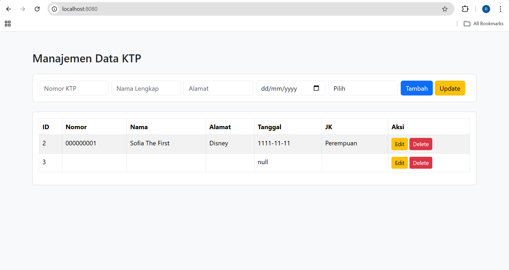

Endpoint

GET http://localhost:8080/ktp
[{"alamat":"Disney","id":2,"jenisKelamin":"Perempuan","namaLengkap":"Sofia The First","nomorKtp":"000000001","tanggalLahir":"1111-11-11"},{"alamat":"","id":3,"jenisKelamin":"","namaLengkap":"","nomorKtp":"","tanggalLahir":null}]

GET http://localhost:8080/ktp/2
{"alamat":"Disney","id":2,"jenisKelamin":"Perempuan","namaLengkap":"Sofia The First","nomorKtp":"000000001","tanggalLahir":"1111-11-11"}
